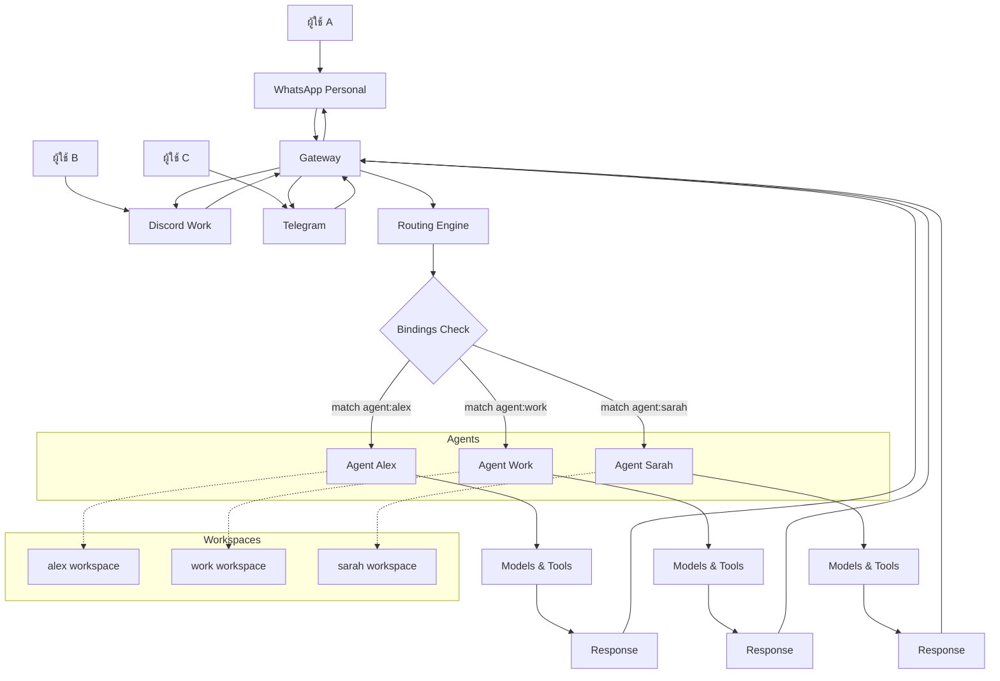

# คู่มือตั้งค่า OpenClaw แบบหลาย Agents

## ภาพรวม Multi-Agent Setup

OpenClaw รองรับการทำงานแบบ **หลาย Agents** ใน Gateway เดียวกัน ซึ่งช่วยให้:

- **หลายคนใช้ร่วมกัน:** แต่ละคนมี AI assistant ส่วนตัว
- **หลายบุคลิก:** Agents ต่างๆ มี workspace และ personality แยกกัน
- **หลายช่องทาง:** แต่ละ agent จัดการ channels ต่างๆ แยกกัน
- **แยกข้อมูล:** Sessions, auth, และ state ถูก isolate กัน

แต่ละ Agent มี:
- **Workspace** ของตัวเอง (AGENTS.md, SOUL.md, USER.md, skills)
- **Agent Directory** สำหรับ auth profiles และ config
- **Session Store** แยกกัน
- **Bindings** สำหรับ routing ข้อความเข้า



**การทำงาน Multi-Agent:**
1. ข้อความจากผู้ใช้ส่งผ่าน Channels ต่างๆ เข้า Gateway
2. Routing Engine ตรวจสอบ Bindings เพื่อกำหนด agent ที่เหมาะสม
3. แต่ละ Agent ประมวลผลข้อความด้วย Models และ Tools ของตัวเอง
4. คำตอบส่งกลับผ่าน Channel เดิม

## ข้อกำหนดเบื้องต้น

- OpenClaw ติดตั้งแล้ว (ดู [README.md](README.md))
- Gateway ทำงานได้ปกติ
- มี config ไฟล์ `~/.openclaw/openclaw.json`

## ขั้นตอนการตั้งค่า Multi-Agent

### 1. เพิ่ม Agent ใหม่

ใช้คำสั่ง agent wizard:

```bash
openclaw agents add work
```

หรือเพิ่ม agent ด้วยตนเองใน config:

```json
{
  "agents": {
    "list": [
      {
        "id": "main",
        "default": true,
        "name": "Main Agent",
        "workspace": "~/.openclaw/workspace",
        "agentDir": "~/.openclaw/agents/main/agent"
      },
      {
        "id": "work",
        "name": "Work Agent",
        "workspace": "~/.openclaw/workspace-work",
        "agentDir": "~/.openclaw/agents/work/agent"
      }
    ]
  }
}
```

### 2. ตั้งค่า Bindings สำหรับ Routing

Bindings กำหนดว่า message จาก channel ไหนจะไป agent ไหน

```json
{
  "bindings": [
    { "agentId": "main", "match": { "channel": "whatsapp", "accountId": "personal" } },
    { "agentId": "work", "match": { "channel": "whatsapp", "accountId": "business" } },
    { "agentId": "work", "match": { "channel": "discord" } }
  ]
}
```

### 3. ตั้งค่า Multiple Accounts ต่อ Channel

สำหรับ channels ที่รองรับหลาย accounts (เช่น WhatsApp):

```json
{
  "channels": {
    "whatsapp": {
      "accounts": {
        "personal": {
          "authDir": "~/.openclaw/credentials/whatsapp/personal"
        },
        "business": {
          "authDir": "~/.openclaw/credentials/whatsapp/business"
        }
      }
    }
  }
}
```

### 4. เริ่ม Gateway และทดสอบ

```bash
openclaw gateway
```

ตรวจสอบ agents:

```bash
openclaw agents list --bindings
```

## ตัวอย่างการตั้งค่าแบบครบถ้วน

### ตัวอย่าง: สอง Agents สำหรับสองคน

```json5
{
  "agents": {
    "list": [
      {
        "id": "alex",
        "name": "Alex's Assistant",
        "workspace": "~/.openclaw/workspace-alex",
        "agentDir": "~/.openclaw/agents/alex/agent"
      },
      {
        "id": "sarah",
        "name": "Sarah's Assistant",
        "workspace": "~/.openclaw/workspace-sarah",
        "agentDir": "~/.openclaw/agents/sarah/agent"
      }
    ]
  },

  "bindings": [
    // Alex ได้ทุกอย่างจาก WhatsApp ส่วนตัว
    { "agentId": "alex", "match": { "channel": "whatsapp", "accountId": "personal" } },

    // Sarah ได้ทุกอย่างจาก Discord และ Telegram
    { "agentId": "sarah", "match": { "channel": "discord" } },
    { "agentId": "sarah", "match": { "channel": "telegram" } },

    // แต่กลุ่มงานใน WhatsApp ไป Sarah
    {
      "agentId": "sarah",
      "match": {
        "channel": "whatsapp",
        "accountId": "personal",
        "peer": { "kind": "group", "id": "1203630...@g.us" }
      }
    }
  ],

  "channels": {
    "whatsapp": {
      "accounts": {
        "personal": {}
      },
      "dmPolicy": "allowlist",
      "allowFrom": ["+66812345678", "+66987654321"]
    },
    "discord": {
      "token": "your_discord_token"
    },
    "telegram": {
      "botToken": "your_telegram_token"
    }
  }
}
```

### ตัวอย่าง: Agent สำหรับงานและส่วนตัว

```json5
{
  "agents": {
    "list": [
      {
        "id": "personal",
        "default": true,
        "name": "Personal Assistant",
        "workspace": "~/.openclaw/workspace-personal"
      },
      {
        "id": "work",
        "name": "Work Assistant",
        "workspace": "~/.openclaw/workspace-work"
      }
    ]
  },

  "bindings": [
    // ทุกอย่างไป personal ก่อน
    { "agentId": "personal", "match": { "channel": "*" } },

    // ยกเว้น Discord server งาน
    { "agentId": "work", "match": { "channel": "discord", "guildId": "123456789012345678" } },

    // และ Slack workspace งาน
    { "agentId": "work", "match": { "channel": "slack", "teamId": "T12345678" } }
  ]
}
```

## การจัดการ Agents

### ดูรายการ Agents

```bash
openclaw agents list
openclaw agents list --bindings  # รวม bindings
```

### เพิ่ม Agent ใหม่

```bash
openclaw agents add <agentId>
```

### ลบ Agent

```bash
openclaw agents remove <agentId>
```

**คำเตือน:** การลบ agent จะลบ workspace และ sessions ถาวร

### สลับไปใช้ Agent อื่น

```bash
openclaw agents switch <agentId>
```

## การตั้งค่า Workspace สำหรับแต่ละ Agent

แต่ละ agent มี workspace แยกกัน สร้างไฟล์สำคัญ:

### สำหรับ Agent แรก (alex):

```bash
mkdir -p ~/.openclaw/workspace-alex
cd ~/.openclaw/workspace-alex

# สร้างไฟล์ identity
cat > AGENTS.md << 'EOF'
# Alex's AI Assistant

I am Alex's personal AI assistant. I help with:
- Personal tasks and reminders
- Casual conversations
- Learning and research
EOF

cat > USER.md << 'EOF'
# About Alex

Alex is a software developer who loves:
- Programming and technology
- Reading sci-fi books
- Playing guitar
EOF

cat > SOUL.md << 'EOF'
# My Personality

I am helpful, friendly, and technically knowledgeable.
I communicate in a casual, approachable way.
EOF
```

### สำหรับ Agent ที่สอง (work):

```bash
mkdir -p ~/.openclaw/workspace-work
cd ~/.openclaw/workspace-work

cat > AGENTS.md << 'EOF'
# Work Assistant

I am a professional work assistant. I help with:
- Business communications
- Project management
- Professional research
EOF

cat > USER.md << 'EOF'
# Professional Context

This is a work environment. Communications should be:
- Professional and concise
- Focused on business objectives
- Appropriate for workplace
EOF
```

## การตั้งค่า Authentication แยกกัน

แต่ละ agent มี auth profiles แยกกัน:

```
~/.openclaw/agents/<agentId>/agent/auth-profiles.json
```

### คัดลอก auth จาก agent หนึ่งไปอีก agent

ถ้าต้องการใช้ auth เดียวกัน:

```bash
cp ~/.openclaw/agents/main/agent/auth-profiles.json ~/.openclaw/agents/work/agent/
```

## Routing Rules และ Bindings

### หลักการทำงาน

1. **Most-specific match wins**: ยิ่งเจาะจง ยิ่งสำคัญ
2. **ลำดับการ match**:
   - `peer` (DM/group/channel id เฉพาะ)
   - `guildId` (Discord server)
   - `teamId` (Slack workspace)
   - `accountId` (channel account)
   - channel-level (`accountId: "*"`)
   - fallback to default agent

### ตัวอย่าง Bindings ที่ซับซ้อน

```json5
{
  "bindings": [
    // DM จากเบอร์เฉพาะไป agent นั้น
    { "agentId": "alex", "match": { "channel": "whatsapp", "peer": { "kind": "dm", "id": "+66812345678" } } },
    { "agentId": "sarah", "match": { "channel": "whatsapp", "peer": { "kind": "dm", "id": "+66987654321" } } },

    // กลุ่มงานไป work agent
    { "agentId": "work", "match": { "channel": "whatsapp", "peer": { "kind": "group", "id": "1203630...@g.us" } } },

    // Discord server งานไป work
    { "agentId": "work", "match": { "channel": "discord", "guildId": "123456789012345678" } },

    // Slack workspace ไป work
    { "agentId": "work", "match": { "channel": "slack", "teamId": "T12345678" } },

    // Telegram ไป personal (default)
    { "agentId": "alex", "match": { "channel": "telegram" } }
  ]
}
```

## การตั้งค่า Channels สำหรับ Multi-Agent

### WhatsApp หลายเบอร์

```json5
{
  "channels": {
    "whatsapp": {
      "accounts": {
        "personal": {
          "authDir": "~/.openclaw/credentials/whatsapp/personal"
        },
        "business": {
          "authDir": "~/.openclaw/credentials/whatsapp/business"
        }
      },
      "dmPolicy": "allowlist",
      "allowFrom": ["+66812345678", "+66987654321", "+66123456789"]
    }
  }
}
```

### Discord กับหลาย Servers

```json5
{
  "channels": {
    "discord": {
      "token": "your_bot_token",
      "guilds": {
        "123456789012345678": {  // Server ID
          "requireMention": true
        }
      }
    }
  }
}
```

## Agent-to-Agent Communication

อนุญาตให้ agents สื่อสารกัน (optional):

```json5
{
  "tools": {
    "agentToAgent": {
      "enabled": true,
      "allow": ["alex", "sarah", "work"]
    }
  }
}
```

## การ Backup และ Restore

### Backup Agents

```bash
# Backup workspaces
tar czf backup-workspaces.tar.gz ~/.openclaw/workspace* ~/.openclaw/agents/

# Backup credentials (ถ้าต้องการ)
tar czf backup-creds.tar.gz ~/.openclaw/credentials/
```

### Restore Agents

```bash
# Restore workspaces
tar xzf backup-workspaces.tar.gz -C ~/

# Restart gateway
openclaw gateway restart
```

## Troubleshooting Multi-Agent

### Agent ไม่ได้รับข้อความ

1. ตรวจสอบ bindings:
   ```bash
   openclaw agents list --bindings
   ```

2. ตรวจสอบ routing logs:
   ```bash
   openclaw logs --grep "routing"
   ```

3. ทดสอบส่งข้อความไป channel นั้น

### Auth ไม่ทำงานสำหรับ agent ใหม่

1. ตรวจสอบ auth-profiles.json ใน agent dir:
   ```bash
   cat ~/.openclaw/agents/<agentId>/agent/auth-profiles.json
   ```

2. คัดลอกจาก agent อื่นหรือตั้งค่าใหม่

### Workspace ไม่ถูกต้อง

1. ตรวจสอบ path ใน config
2. ตรวจสอบ permissions:
   ```bash
   ls -la ~/.openclaw/workspace-<agentId>/
   ```

## Best Practices

### 1. ใช้ Naming Convention ที่สอดคล้อง

- `main`, `work`, `personal`
- หรือชื่อคน: `alex`, `sarah`, `john`

### 2. แยก Workspace ชัดเจน

- ใช้โฟลเดอร์แยก: `workspace-alex`, `workspace-work`
- แต่ละ workspace มีไฟล์ identity ของตัวเอง

### 3. จัดการ Auth Profiles

- เก็บ auth profiles แยกต่อ agent
- ใช้ API keys แยกถ้าจำเป็น

### 4. Monitor และ Logs

- ใช้ `openclaw logs` เพื่อ debug routing
- ตรวจสอบ session isolation

### 5. Backup อย่างสม่ำเสมอ

- Backup workspaces และ agent configs
- เก็บ credentials แยกถ้าจำเป็น

## Migration จาก Single Agent

ถ้ามี single agent อยู่แล้วและต้องการเพิ่ม agent ใหม่:

1. Backup ทุกอย่างก่อน
2. เพิ่ม agent ใหม่ใน config
3. ย้าย workspace เก่าไปเป็น workspace ของ main agent
4. ตั้งค่า bindings
5. Restart gateway

## อ้างอิง

- [Multi-Agent Concepts](/concepts/multi-agent) - รายละเอียดทางเทคนิค
- [Gateway Configuration](/gateway/configuration) - Config schema
- [Bindings Reference](/gateway/configuration#bindings) - Routing rules
- [Agents CLI](/cli/agents) - คำสั่งจัดการ agents</content>
<parameter name="filePath">d:\Projects\Github\Openclaw-Setup\MULTI-AGENT-SETUP.md