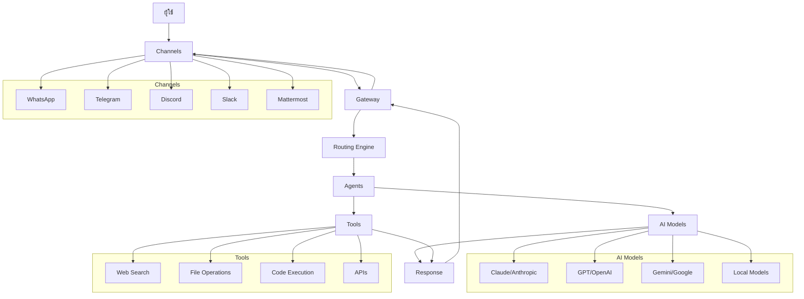

# OpenClaw Setup

## คำอธิบายโปรเจกต์

OpenClaw เป็น AI Assistant ที่ช่วยให้คุณสามารถสนทนากับ AI ผ่านช่องทางต่างๆ เช่น WhatsApp, Telegram, Discord, และอื่นๆ โดยใช้โมเดล AI จาก Anthropic, OpenAI, หรือผู้ให้บริการอื่นๆ OpenClaw ประกอบด้วย Gateway ที่จัดการการเชื่อมต่อและ Agent ที่ประมวลผลข้อความ

โปรเจกต์นี้เป็น repository สำหรับการตั้งค่าและเอกสารประกอบในการติดตั้งและใช้งาน OpenClaw

## สถาปัตยกรรมและการทำงาน



**การทำงาน:**
1. **ผู้ใช้** ส่งข้อความผ่าน **Channels** (WhatsApp, Telegram, etc.)
2. **Gateway** รับข้อความและส่งไปยัง **Routing Engine**
3. **Routing Engine** กำหนดว่า agent ไหนจะจัดการข้อความนี้
4. **Agent** ประมวลผลข้อความโดยใช้ **AI Models** และ **Tools** ตามต้องการ
5. **Agent** สร้างคำตอบและส่งกลับผ่าน Gateway และ Channel เดิม

## ข้อกำหนดระบบ

ก่อนเริ่มการติดตั้ง ตรวจสอบให้แน่ใจว่าคุณมีสิ่งต่อไปนี้:

- **Node.js เวอร์ชัน 22 หรือสูงกว่า** (ตรวจสอบด้วย `node -v`)
- **ระบบปฏิบัติการ:** macOS, Linux, หรือ Windows ผ่าน WSL2 (แนะนำ Ubuntu บน WSL2)
- **pnpm** (ถ้าต้องการติดตั้งจาก source หรือพัฒนา)
- **Docker** (ไม่บังคับ; สำหรับการตั้งค่าแบบ containerized)

สำหรับ macOS: ถ้าต้องการ build apps ติดตั้ง Xcode Command Line Tools  
สำหรับ Windows: ใช้ WSL2 เท่านั้น เพราะ Windows แบบ native ไม่รองรับอย่างสมบูรณ์

## วิธีติดตั้ง OpenClaw

**สำหรับวิธีติดตั้งแบบปลอดภัยที่สุด (แนะนำสำหรับ production หรือผู้ที่ต้องการความปลอดภัยสูง) ดู [INSTALL-SECURE.md](INSTALL-SECURE.md)**

### 1. วิธีติดตั้งด่วน (แนะนำสำหรับผู้ใช้ทั่วไป)

วิธีนี้จะติดตั้ง CLI และรัน onboarding อัตโนมัติ

```bash
curl -fsSL https://openclaw.ai/install.sh | bash
```

สำหรับ Windows (PowerShell):

```powershell
iwr -useb https://openclaw.ai/install.ps1 | iex
```

หลังติดตั้งเสร็จ จะมีตัวเลือกในการรัน onboarding ถ้าคุณข้ามไป ให้รันคำสั่งนี้:

```bash
openclaw onboard --install-daemon
```

### 2. ติดตั้งแบบ Global (ด้วย npm หรือ pnpm)

ถ้าคุณมี Node.js อยู่แล้ว:

```bash
npm install -g openclaw@latest
```

หรือใช้ pnpm:

```bash
pnpm add -g openclaw@latest
pnpm approve-builds -g  # อนุมัติ build scripts สำหรับ packages ที่ต้องการ
```

หลังติดตั้ง รัน onboarding:

```bash
openclaw onboard --install-daemon
```

**หมายเหตุ:** ถ้ามีปัญหากับ sharp package บน macOS ให้ตั้งค่า environment variable:

```bash
SHARP_IGNORE_GLOBAL_LIBVIPS=1 npm install -g openclaw@latest
```

### 3. ติดตั้งจาก Source Code (สำหรับนักพัฒนาหรือผู้ที่ต้องการแก้ไขโค้ด)

```bash
git clone https://github.com/openclaw/openclaw.git
cd openclaw
pnpm install
pnpm ui:build  # build UI dependencies
pnpm build
openclaw onboard --install-daemon
```

ถ้ายังไม่มี global install ให้รันคำสั่งจาก repo ด้วย `pnpm openclaw ...`

### ตัวเลือกการติดตั้งอื่นๆ

- **Docker:** ดู [Docker Installation](/install/docker)
- **Nix:** ดู [Nix Installation](/install/nix)
- **Ansible:** ดู [Ansible Installation](/install/ansible)
- **Bun (CLI เท่านั้น):** ดู [Bun Installation](/install/bun)

## การตั้งค่าเริ่มต้น (Setup)

หลังติดตั้ง ให้รันการตั้งค่าเพื่อกำหนดค่า workspace และ config:

```bash
openclaw setup
```

สิ่งนี้จะสร้าง:
- `~/.openclaw/openclaw.json` (ไฟล์ config)
- `~/.openclaw/workspace` (workspace สำหรับ skills, prompts, memories)

**เคล็ดลับ:** เก็บ customization ของคุณใน `~/.openclaw/` แทนที่จะแก้ใน repo เพื่อให้ง่ายต่อการ update

### การรัน Onboarding Wizard

Wizard จะช่วยตั้งค่า:
- การเลือก Gateway (Local หรือ Remote)
- การตั้งค่า Authentication (OAuth สำหรับ Anthropic หรือ API keys)
- การตั้งค่า Channels (WhatsApp, Telegram, Discord, etc.)
- การตั้งค่า Pairing และ Security
- การติดตั้ง Background Service

```bash
openclaw onboard --install-daemon
```

## การเริ่มใช้งาน Gateway

Gateway เป็น core component ที่จัดการการเชื่อมต่อ

### ตรวจสอบสถานะ Gateway

```bash
openclaw gateway status
```

### รัน Gateway แบบ Manual

```bash
openclaw gateway --port 18789 --verbose
```

**คำเตือน:** สำหรับ WhatsApp และ Telegram ควรใช้ Node ไม่ใช่ Bun เพราะมีปัญหา compatibility

### เปิด Dashboard

```bash
openclaw dashboard
```

หรือเปิดใน browser: `http://127.0.0.1:18789/`

## การตั้งค่า Authentication

### วิธีแนะนำ: OAuth สำหรับ Anthropic

ใน wizard เลือก OAuth และทำตามขั้นตอนใน browser

### ใช้ API Key

ตั้งค่าใน config หรือ environment variables

สำหรับ Brave Search (แนะนำสำหรับ web search):

```bash
openclaw configure --section web
```

## การเชื่อมต่อ Channels (ช่องทางการสนทนา)

### WhatsApp

```bash
openclaw channels login
```

เปิด WhatsApp → Settings → Linked Devices → Link a Device และสแกน QR code

### Telegram

ตั้งค่า bot token ใน config หรือผ่าน wizard

ดูรายละเอียด: [Telegram Setup](/channels/telegram)

### Discord

ตั้งค่า bot token

ดูรายละเอียด: [Discord Setup](/channels/discord)

### อื่นๆ

- Mattermost: [Mattermost Setup](/channels/mattermost)
- Slack: ตั้งค่า tokens ใน config
- และอื่นๆ ในโฟลเดอร์ [channels](/channels/)

## การตั้งค่าขั้นสูง

- **Multi-Agent Setup:** สำหรับใช้งานหลาย agents ดู [MULTI-AGENT-SETUP.md](MULTI-AGENT-SETUP.md)
- **การติดตั้งแบบปลอดภัย:** ดู [INSTALL-SECURE.md](INSTALL-SECURE.md)
- **คู่มือหา API Keys:** ดู [API-KEYS-GUIDE.md](API-KEYS-GUIDE.md)

## การตั้งค่า Pairing และ Security

โดย default DMs ที่ไม่รู้จักจะต้องได้รับอนุมัติก่อน

ตรวจสอบ pairing requests:

```bash
openclaw pairing list whatsapp
openclaw pairing approve whatsapp <code>
```

ดูรายละเอียด: [Pairing Guide](/start/pairing)

## การทดสอบการทำงาน

ส่งข้อความทดสอบ:

```bash
openclaw message send --target +1234567890 --message "Hello from OpenClaw"
```

ตรวจสอบสุขภาพระบบ:

```bash
openclaw health
openclaw status --all
```

## การตั้งค่า Workspace และ Customization

Workspace อยู่ที่ `~/.openclaw/workspace`

- `AGENTS.md`: รายละเอียด agents
- `IDENTITY.md`: ข้อมูลตัวตน
- `USER.md`: ข้อมูลผู้ใช้
- Skills และ prompts อื่นๆ

ทำเป็น git repo ส่วนตัวเพื่อ backup

## การ update และการย้ายเครื่อง

### Update

```bash
npm update -g openclaw
# หรือสำหรับ source: git pull && pnpm install
```

### ย้ายเครื่อง

คัดลอก `~/.openclaw/` ไปยังเครื่องใหม่

ดู: [Migrating Guide](/install/migrating)

## การแก้ปัญหา (Troubleshooting)

### `openclaw` ไม่พบใน PATH

ตรวจสอบ PATH:

```bash
npm prefix -g
echo $PATH
```

เพิ่ม path ไปยัง shell startup file (เช่น `~/.zshrc` หรือ `~/.bashrc`):

```bash
export PATH="$(npm prefix -g)/bin:$PATH"
```

แล้วเปิด terminal ใหม่

### ปัญหาอื่นๆ

รัน diagnostic:

```bash
openclaw doctor
```

ดู logs:

```bash
openclaw logs
```

สำหรับปัญหาเฉพาะ channel ดูใน [channels troubleshooting](/channels/troubleshooting)

## เอกสารประกอบเพิ่มเติม

- [USER-GUIDE.md](USER-GUIDE.md) - คู่มือผู้ใช้ฉบับสมบูรณ์
- [Getting Started](/start/getting-started) - คู่มือเริ่มต้นแบบละเอียด
- [Setup Guide](/start/setup) - คู่มือตั้งค่าลึก
- [Gateway Configuration](/gateway/configuration) - ตั้งค่า Gateway
- [Security](/gateway/security) - ความปลอดภัย
- [CLI Reference](/cli/) - คำสั่ง CLI ทั้งหมด
- [Channels](/channels/) - ตั้งค่า channels ต่างๆ
- [Tools](/tools/) - เครื่องมือต่างๆ
- [Platforms](/platforms/) - การใช้งานบนแพลตฟอร์มต่างๆ

สำหรับคำถามหรือปัญหา สามารถดูใน docs/ หรือติดต่อชุมชน

