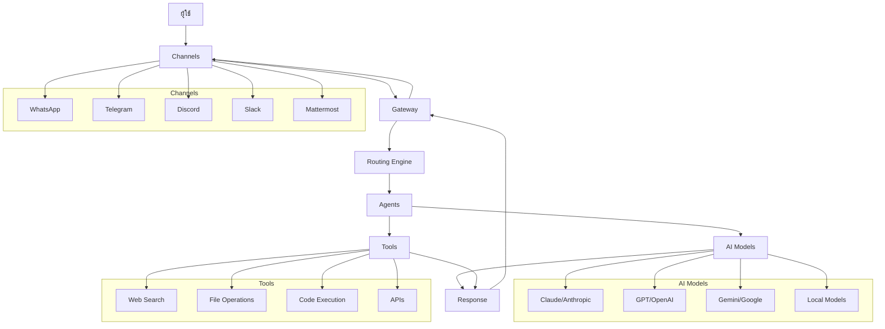

# OpenClaw User Guide

## ภาพรวมสถาปัตยกรรม



**การทำงานของระบบ:**
1. **ผู้ใช้** ส่งข้อความผ่าน **Channels** ต่างๆ
2. **Gateway** รับข้อความและจัดการการเชื่อมต่อ
3. **Routing Engine** กำหนด agent ที่เหมาะสม
4. **Agent** ประมวลผลโดยใช้ **AI Models** และ **Tools**
5. คำตอบส่งกลับผ่านช่องทางเดิม

## Get Started

### เริ่มต้นใช้งาน OpenClaw

OpenClaw เป็น AI Assistant ที่ช่วยให้คุณสามารถสนทนากับ AI ผ่านช่องทางต่างๆ เช่น WhatsApp, Telegram, Discord และอื่นๆ

#### ขั้นตอนเริ่มต้นด่วน

1. **ติดตั้ง OpenClaw:**
   ```bash
   curl -fsSL https://openclaw.ai/install.sh | bash
   ```

2. **รัน Onboarding:**
   ```bash
   openclaw onboard --install-daemon
   ```

3. **เชื่อมต่อ Channel แรก:**
   ```bash
   openclaw channels login  # สำหรับ WhatsApp
   ```

4. **ทดสอบ:**
   ```bash
   openclaw message send --target +1234567890 --message "Hello!"
   ```

#### เรียนรู้เพิ่มเติม

- [Getting Started Guide](/start/getting-started) - คู่มือเริ่มต้นแบบละเอียด
- [Quick Start](/start/quickstart) - เริ่มใช้งานใน 5 นาที
- [Onboarding](/start/onboarding) - กระบวนการตั้งค่าเริ่มต้น

---

## Install

### วิธีการติดตั้ง

#### ติดตั้งด่วน (แนะนำ)
```bash
curl -fsSL https://openclaw.ai/install.sh | bash
```

#### ติดตั้งแบบปลอดภัย
ดู [INSTALL-SECURE.md](INSTALL-SECURE.md) สำหรับวิธีติดตั้งที่ปลอดภัยที่สุด รวมถึงการใช้ Docker และ build จาก source

#### ตัวเลือกการติดตั้งอื่นๆ
- [Docker Installation](/install/docker) - ใช้ Container
- [Nix Installation](/install/nix) - ใช้ Nix package manager
- [From Source](/install) - สำหรับนักพัฒนา

#### หลังติดตั้ง
- [Updating](/install/updating) - อัปเดต OpenClaw
- [Uninstall](/install/uninstall) - ถอนการติดตั้ง
- [Migrating](/install/migrating) - ย้ายไปเครื่องใหม่

---

## Channels

### การตั้งค่า Channels (ช่องทางการสนทนา)

OpenClaw รองรับการเชื่อมต่อกับแพลตฟอร์มต่างๆ เพื่อให้ AI สามารถตอบสนองข้อความได้

#### การหา API Keys และ Tokens
ดู [API-KEYS-GUIDE.md](API-KEYS-GUIDE.md) สำหรับวิธีหา keys สำหรับแต่ละ platform

#### Channels ที่รองรับ

##### WhatsApp
- [WhatsApp Setup](/channels/whatsapp)
- ใช้ QR code login
- รองรับหลายเบอร์โทรศัพท์

##### Telegram
- [Telegram Setup](/channels/telegram)
- ใช้ Bot API Token จาก @BotFather
- รองรับ DMs และ Groups

##### Discord
- [Discord Setup](/channels/discord)
- ใช้ Bot Token จาก Developer Portal
- รองรับ DMs และ Guild Channels

##### Slack
- [Slack Setup](/channels/slack)
- ใช้ App Token และ Bot Token
- รองรับ Socket Mode และ Webhook

##### Mattermost
- [Mattermost Setup](/channels/mattermost)
- ใช้ Bot Access Token
- รองรับ Self-hosted และ Cloud

##### อื่นๆ
- [LINE](/channels/line)
- [Signal](/channels/signal)
- [iMessage](/channels/imessage) (macOS only)
- [Zalo](/channels/zalouser)
- [Twitch](/channels/twitch)
- [And more...](/channels/)

#### การจัดการ Channels
```bash
openclaw channels list          # ดู channels ที่เชื่อมต่อ
openclaw channels login         # เชื่อมต่อ channel ใหม่
openclaw channels logout <id>   # ตัดการเชื่อมต่อ
```

#### Troubleshooting
- [Channels Troubleshooting](/channels/troubleshooting)
- [Pairing Guide](/start/pairing) - จัดการ DM approvals

---

## Agents

### การตั้งค่า Agents

Agent คือ "สมอง" ของ AI ที่มี personality และ workspace ของตัวเอง

#### Single Agent (เริ่มต้น)
โดย default OpenClaw ใช้ agent เดียวชื่อ "main"

#### Multi-Agent Setup
ดู [MULTI-AGENT-SETUP.md](MULTI-AGENT-SETUP.md) สำหรับการตั้งค่าหลาย agents

##### ทำไมถึงใช้หลาย Agents?
- หลายคนใช้ร่วมกันแต่แยกข้อมูล
- Agents ต่างบุคลิกกัน
- แยกงานส่วนตัวและทำงาน

##### การจัดการ Agents
```bash
openclaw agents list              # ดู agents ทั้งหมด
openclaw agents add <name>        # เพิ่ม agent ใหม่
openclaw agents remove <name>     # ลบ agent
openclaw agents switch <name>     # สลับไปใช้ agent อื่น
```

##### Agent Configuration
แต่ละ agent มี:
- **Workspace**: โฟลเดอร์สำหรับไฟล์และ personality
- **Auth Profiles**: API keys และ credentials
- **Sessions**: ประวัติการสนทนา

##### Bindings & Routing
กำหนดว่า message จาก channel ไหนไป agent ไหน
```json
{
  "bindings": [
    { "agentId": "work", "match": { "channel": "slack" } },
    { "agentId": "personal", "match": { "channel": "whatsapp" } }
  ]
}
```

#### Agent Identity
แต่ละ agent มีไฟล์กำหนดตัวตน:
- `AGENTS.md` - บทบาทและหน้าที่
- `USER.md` - ข้อมูลเกี่ยวกับผู้ใช้
- `SOUL.md` - บุคลิกและลักษณะนิสัย

---

## Tools

### เครื่องมือที่พร้อมใช้งาน

OpenClaw มีเครื่องมือมากมายที่ agent สามารถใช้ได้

#### Built-in Tools
- **Web Search**: ค้นหาข้อมูลจากอินเทอร์เน็ต
- **File Operations**: อ่าน/เขียนไฟล์
- **Code Execution**: รันโค้ด
- **API Calls**: เรียกใช้ external APIs
- **Media Processing**: จัดการรูปภาพและไฟล์

#### การตั้งค่า Tools
```json
{
  "tools": {
    "web": {
      "search": {
        "apiKey": "your_brave_search_key"
      }
    }
  }
}
```

#### Custom Tools & Skills
- [Skills](/tools/skills) - เพิ่มความสามารถเอง
- [Slash Commands](/tools/slash-commands) - คำสั่งพิเศษ
- [Hooks](/hooks) - Automation และ integrations

#### Tools Reference
- [Web Tools](/tools/web) - ค้นหาและ browse
- [File Tools](/tools/file) - จัดการไฟล์
- [Media Tools](/tools/media) - รูปภาพและวิดีโอ
- [Code Tools](/tools/code) - การเขียนโปรแกรม
- [API Tools](/tools/api) - External integrations

---

## Models

### การตั้งค่า AI Models

OpenClaw รองรับโมเดล AI จากผู้ให้บริการต่างๆ

#### Supported Providers
- **Anthropic Claude** (แนะนำ)
- **OpenAI GPT**
- **Google Gemini**
- **Local Models** (Ollama, LM Studio)
- **Custom APIs**

#### Authentication
```json
{
  "agents": {
    "list": [
      {
        "auth": {
          "anthropic": {
            "apiKey": "your_key"
          }
        }
      }
    ]
  }
}
```

#### Model Configuration
```json
{
  "models": {
    "default": "claude-3-5-sonnet-20241022",
    "providers": {
      "anthropic": {
        "models": ["claude-3-5-sonnet-20241022", "claude-3-haiku-20240307"]
      }
    }
  }
}
```

#### Model Failover
OpenClaw สามารถสลับไปใช้โมเดลสำรองได้โดยอัตโนมัติ
- [Model Failover](/concepts/model-failover)

#### Local Models
รันโมเดลบนเครื่องของคุณเอง
- [Ollama Integration](/providers/ollama)
- [LM Studio](/providers/lm-studio)

---

## Gateway & Ops

### Gateway Management

Gateway คือ core component ที่จัดการการเชื่อมต่อและ routing

#### การเริ่ม Gateway
```bash
openclaw gateway start     # เริ่มเป็น background service
openclaw gateway stop      # หยุด service
openclaw gateway status    # ตรวจสอบสถานะ
```

#### Gateway Configuration
```json
{
  "gateway": {
    "port": 18789,
    "auth": {
      "token": "your_secure_token"
    },
    "security": {
      "auditLog": true
    }
  }
}
```

#### Monitoring & Health Checks
```bash
openclaw health           # ตรวจสอบสุขภาพ
openclaw status           # สถานะโดยรวม
openclaw logs             # ดู logs
```

#### Operations
- [Gateway Runbook](/gateway) - การจัดการ Gateway
- [Configuration](/gateway/configuration) - ตั้งค่า Gateway
- [Security](/gateway/security) - ความปลอดภัย
- [Remote Access](/gateway/remote) - เข้าถึงจากระยะไกล
- [Sandboxing](/gateway/sandboxing) - แยก execution environment

#### Troubleshooting
- [Diagnostics](/diagnostics) - วินิจฉัยปัญหา
- [Debugging](/debugging) - Debug mode
- [Logging](/logging) - การจัดการ logs

---

## Platforms

### การใช้งานบนแพลตฟอร์มต่างๆ

OpenClaw รองรับหลายระบบปฏิบัติการและสภาพแวดล้อม

#### Desktop Platforms
- **macOS**: [macOS Guide](/platforms/macos)
  - Menu bar app
  - Voice integration
  - System automation

- **Windows**: [Windows Guide](/platforms/windows)
  - WSL2 (แนะนำ)
  - Native support (limited)

- **Linux**: [Linux Guide](/platforms/linux)
  - Systemd services
  - Package managers

#### Cloud Platforms
- **VPS/Cloud**: [VPS Setup](/platforms/vps)
  - DigitalOcean, Linode, Hetzner
  - AWS, GCP, Azure

- **Docker**: [Docker Platforms](/platforms/docker)
  - Containerized deployment
  - Kubernetes support

#### Mobile & Remote
- **iOS**: [iOS Guide](/platforms/ios)
  - Canvas app
  - Camera integration

- **Android**: [Android Guide](/platforms/android)
  - Companion app

#### Specialized
- **exe.dev**: [exe.dev](/platforms/exe-dev)
- **Railway**: [Railway](/platforms/railway)
- **Northflank**: [Northflank](/platforms/northflank)
- **VPS Providers**: [Hetzner](/platforms/hetzner), [macOS Remote](/platforms/mac/remote)

#### Development
- [Development Setup](/start/setup) - สำหรับนักพัฒนา
- [Contributing](/contributing) - มีส่วนร่วมในโปรเจกต์

---

## Additional Resources

### CLI Reference
- [CLI Overview](/cli/) - คำสั่งทั้งหมด
- [Commands](/cli/commands) - รายละเอียดคำสั่ง

### Concepts
- [Architecture](/concepts/architecture) - โครงสร้างระบบ
- [Sessions](/concepts/sessions) - การจัดการ session
- [Memory](/concepts/memory) - ระบบความจำ
- [Context](/concepts/context) - การจัดการ context

### Automation
- [Cron Jobs](/automation/cron-jobs) - ตั้งเวลา
- [Webhooks](/automation/webhooks) - Integration
- [Gmail Integration](/automation/gmail-pubsub)

### Security
- [Security Guide](/gateway/security) - แนวทางความปลอดภัย
- [Credential Storage](/gateway/security#credential-storage-map)

### Support
- [Troubleshooting](/troubleshooting) - แก้ปัญหา
- [FAQ](/faq) - คำถามที่พบบ่อย
- [Community](/community) - ชุมชน

---

*เอกสารนี้เป็นคู่มือหลักสำหรับผู้ใช้ OpenClaw สำหรับรายละเอียดเพิ่มเติม ดูในโฟลเดอร์ docs/*</content>
<parameter name="filePath">d:\Projects\Github\Openclaw-Setup\USER-GUIDE.md